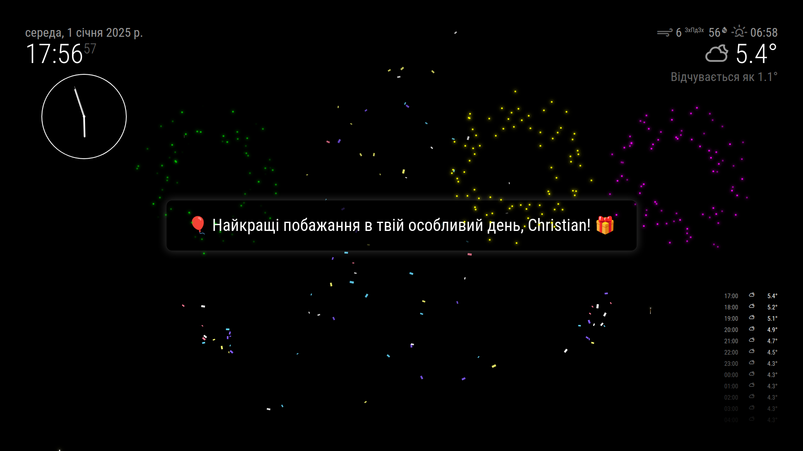

# MMM-Birthday

# MMM-Birthday

A MagicMirror² module that celebrates birthdays with animated fireworks and confetti effects.




## Features

- Automatic birthday detection and celebration
- Animated fireworks display
- Confetti effects
- Multilingual support
- Configurable celebration durations
- Temporary dimming of other modules during celebrations

## Installation

1. Navigate to your MagicMirror's modules directory:
```bash
cd ~/MagicMirror/modules
```

2. Clone this repository:
```bash
git clone https://github.com/cgillinger/MMM-Birthday.git
```

3. Install dependencies:
```bash
cd MMM-Birthday
npm install
```

## Configuration

Add the module to your `config/config.js` file:

```javascript
{
    module: "MMM-Birthday",
    position: "middle_center", // Module will be centered during celebrations
    config: {
        birthdays: [
            { name: "Anna", date: "03-15" },
            { name: "Beth", date: "07-22" },
            { name: "Charlie", date: "12-25 08:00" }
        ],
        fireworkDuration: "infinite", // or specific duration in milliseconds
        confettiDuration: "infinite"  // or specific duration in milliseconds
    }
}
```

### Global Settings

The module's language is controlled by your MagicMirror's global language setting. To change the language, modify the global `language` setting in your `config/config.js`:

```javascript
{
    language: "en", // en, sv, da, de, es, fi, fr, it, nl, no, pt, uk
    ...
}
```

### Configuration Options

| Option | Description | Default |
|--------|-------------|---------|
| `birthdays` | Array of birthday objects containing name and date | `[]` |
| `fireworkDuration` | Duration of fireworks in ms or "infinite" | "infinite" |
| `confettiDuration` | Duration of confetti in ms or "infinite" | "infinite" |

#### Birthday Format
- Date format: `MM-DD` or `MM-DD HH:mm`
- Example: `"12-25"` for December 25th
- Example with time: `"12-25 08:00"` for December 25th at 8:00 AM

## Dependencies

- MagicMirror²: Minimum version 2.15.0
- Node.js: Minimum version 12.0.0
- canvas-confetti: ^1.9.3

## Author

- Christian Gillinger
- License: MIT
- Version: 1.2.5

## Support

For issues and feature requests, please use the [GitHub issue tracker](https://github.com/yourusername/MMM-Birthday/issues).
